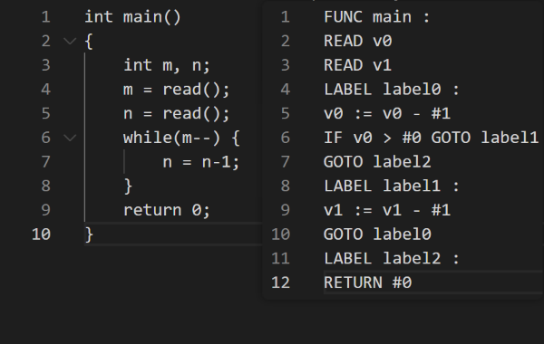

# Project Phase 3 Report

| SID      | Name   | Rate |
| -------- | ------ | ---- |
| 11911202 | 袁恒宸 | 1/3  |
| 12011543 | 林洁芳 | 1/3  |
| 12011906 | 汤奕飞 | 1/3  |

## Basic

In the intermediate representation generation section, we use tac class to generate IR code, including v, t variable and label. Based on semantic analysis, we use tac to connect them in series.

### Test

We can pass all the tests.

### Optimization

In the process of implementation, the following aspects were optimized.

1. Numbers can be used directly as a variables.

2. Subtracting two identical numbers directly assigns the result to 0.
3. Any number plus or minus zero is itself.
4. 1 multiplied by any number and any number divided by 1 is itself.
5. Self-increment and self-decrement do not use additional temporary variables.
6. *The address of the first element of an array or the first variable of a structure is the starting address of the array or structure.

Several of the following attempted optimization strategies are incorrect.

1. A number multiplied by a number and divided by the same number does not necessarily equal itself.
2. Since it is not possible to ensure whether a variable has been modified again, the same operation on the same variable cannot use the previously computed result.

What is listed above is roughly the entirety of the optimization.

As for tac.h:

```c
#ifndef _TAC
#define _TAC

typedef struct tac
{
    enum { FUNC = 0, READ, WRITE, LABEL, GOTO, IF, ASS, OPER, RETURN, PARAM, ARG, DEC} title;
    char* target;
    char* op;
    char* arg1;
    char* arg2;
    struct tac* next;
} Tac;

Tac * newTac(char* target, char* op, char* arg1, char* arg2);

void printTacs(Tac* head);

char* generateV(int v);

char* generateT(int t);

char* generateLabel(int lbl);

#endif
```

## Bonus

We can pass all bonus part tests in GitHub. Since these tests are complicate enough and some of our group members are sick, we write relatively simple extra tests which can cover all bonus parts we writed.

### Multi-dimensional array

We can handle one-dimensional and even multi-dimensional nested arrays, including INT arrays as well as custom structure arrays.

In test:


### Structure

We can handle structure. Structure variables can appear in the program, and they can be declared as function parameters. The internal member variables of a structure can be either arrays or basic data types, in this case INT.

In test:


### Continue & Break

We can handle continue and break instructions, which can jump correctly when encountered in the while loop.

In test:


### while(T--/--T)

We can handle while(T--){} block, where the loop body will execute T times for any non-negative integer T, and the loop terminates when T reaches zero.

In test:



### Ternary operator(... ? ... : ...)

In translation.c:

```c
else if(!strcmp(NDtypes[operator->type],"QM")){
    //Exp QM Exp COLON Exp
    ...
}
```

In test:

