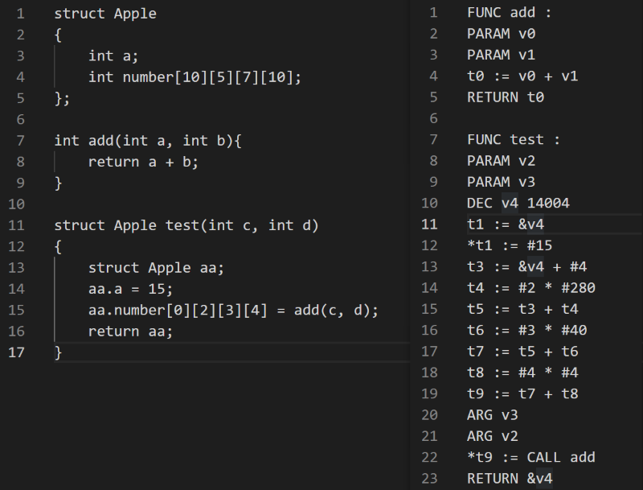
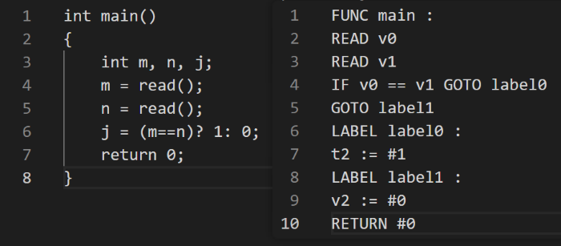

# Project Phase 3 Report

| SID      | Name   | Rate |
| -------- | ------ | ---- |
| 11911202 | 袁恒宸 | 1/3  |
| 12011543 | 林洁芳 | 1/3  |
| 12011906 | 汤奕飞 | 1/3  |

## Basic

In the intermediate representation generation section, we use tac class to generate IR code, including v, t variable and label. Based on semantic analysis, we use tac to connect them in series.

As for tac.h:

```c
#ifndef _TAC
#define _TAC

typedef struct tac
{
    enum { FUNC = 0, READ, WRITE, LABEL, GOTO, IF, ASS, OPER, RETURN, PARAM, ARG, DEC} title;
    char* target;
    char* op;
    char* arg1;
    char* arg2;
    struct tac* next;
} Tac;

Tac * newTac(char* target, char* op, char* arg1, char* arg2);

void printTacs(Tac* head);

char* generateV(int v);

char* generateT(int t);

char* generateLabel(int lbl);

#endif
```

For translation.h:

```c
#ifndef _SEMANTIC_ANALYSIS
#define _SEMANTIC_ANALYSIS

#include "node.h"
#include "type.h"

typedef struct FuncParamLinkNode {
    char* tag;
    struct FuncParamLinkNode* prev;
    struct FuncParamLinkNode* next;
} FuncParamLinkNode;

typedef struct node *Node;

...

#endif
```

## Bonus

### multi-dimensional array

in translation.c

```c
FieldList *parseVarDec(int isStructDef, int isFuncParam, Node varDec, Type *type) {
    //VarDec: VarDec LB INT RB (Array)
    //       |ID
    ...
}
```

in test



### structure

in translation.c

```c
else if (!strcmp(NDtypes[leftmost->type], "StructSpecifier")) {
    //STRUCT ID
    ...
    //STRUCT ID LC DefList RC
    ...
}
```

in test


### continue and break

in translation.c

```c
else if (!strcmp(NDtypes[leftmost->type],"BREAK")){
    //BREAK SEMI
    ...
}
    }else if (!strcmp(NDtypes[leftmost->type],"CONTINUE")){
    //CONTINUE SEMI
    ...
}
```

in test


### --

in translation.c

```c
else if (!strcmp(NDtypes[leftmost->type],"DMINUS")) {
    //DMINUS Exp
    ...
}
```

in test


### Ternary operator(...? ...: ...)

in translation.c

```c
else if(!strcmp(NDtypes[operator->type],"QM")){
    //Exp QM Exp COLON Exp
    ...
}
```

in test

